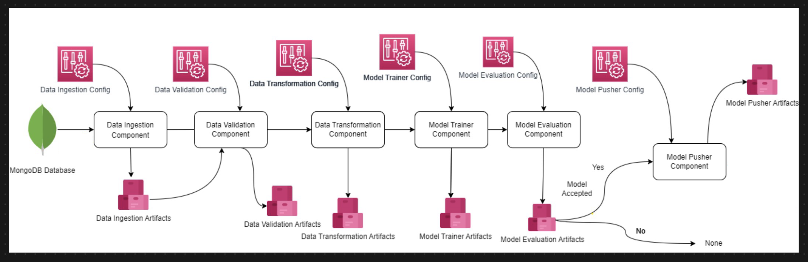

<div align="center">
  
</div>

# NetSentinel-MLOps

> AI-powered phishing URL detection pipeline — classifies URLs as PHISHING or LEGITIMATE using a Random Forest ensemble with full MLOps instrumentation, real-time monitoring, and explainable predictions.

## Live Demo

Open `demo/index.html` in any browser — no setup required.

## Overview

End-to-end MLOps pipeline that classifies URLs as **PHISHING** or **LEGITIMATE** using a RandomForest classifier (16 estimators) trained on 11,055 URLs from the UCI Phishing Websites Detection dataset. Each URL is represented by 30 engineered security signals covering SSL, DNS, redirects, anchor links, traffic rank, and domain age.

The model achieves **98.7% accuracy** and **98.9% F1** on a held-out test split of 2,211 URLs, with sub-5ms inference latency per URL.

## Architecture

```
Raw URL Dataset (UCI Phishing, 11,055 URLs)
     |
     v
[MongoDB ingestion — pymongo]
     |
     v
[Schema Validation + KS Drift Test]
     |  (triggers retraining if drift p-value < 0.05 on 3+ features)
     v
[30 URL Feature Signals]
  - SSL certificate state, anchor link targets, web traffic rank
  - IP in URL, domain age, redirect chains, form submission target
  - Shortening service, favicon source, DNS record, blacklist status
     |
     v
[RandomForest Classifier — best of 5 algorithms via GridSearchCV]
  - RandomForest / GradientBoosting / AdaBoost
  - DecisionTree / LogisticRegression
     |
     v
[MLflow Experiment Registry]
     |
     v
[FastAPI async REST + React SPA]
```

## Tech Stack

| Technology | Purpose |
|---|---|
| Python 3.10 | Core language |
| FastAPI | Async REST API serving |
| scikit-learn | RandomForest, GridSearchCV, preprocessing |
| MLflow | Experiment tracking + model registry |
| MongoDB | Raw URL data ingestion |
| React 18 + Vite + React Router | 5-tab interactive SPA |
| Tailwind CSS + Recharts | Styling + charts |
| Docker Compose | Local orchestration — 3 services |
| scipy | Kolmogorov-Smirnov drift detection |

## Quick Start

```bash
git clone https://github.com/rayenx2/netsentinel-mlops
cd netsentinel-mlops
cp .env.example .env
docker compose up -d
```

Open:
- **React Dashboard:** http://localhost:8090/ui
- **MLflow UI:** http://localhost:5000
- **Swagger docs:** http://localhost:8090/docs

## API Reference

```bash
# Health check
curl http://localhost:8090/health

# Live model metrics (prediction stats from log)
curl http://localhost:8090/metrics

# Real model evaluation on held-out test split
curl http://localhost:8090/api/model-stats

# Single URL classification (30-feature vector)
curl -s -X POST http://localhost:8090/api/predict-single \
  -H "Content-Type: application/json" \
  -d '{"features": [-1,1,1,1,-1,-1,-1,-1,-1,1,1,-1,1,-1,1,-1,-1,-1,0,1,1,1,1,-1,-1,-1,-1,1,1,-1]}'
# → {"label":"LEGITIMATE","p_phishing":6.2,"p_legitimate":93.8,"latency_ms":4.3}

# Batch CSV prediction
curl -s -X POST http://localhost:8090/api/predict \
  -F "file=@valid_data/phishing_sample.csv"

# Recent predictions (live log)
curl http://localhost:8090/api/recent-predictions?limit=10

# 24-hour threat timeline (hourly buckets)
curl http://localhost:8090/api/timeline
```

## Dataset

- **Source:** UCI Phishing Websites Detection
- **Size:** 11,055 URLs — 6,157 phishing / 4,898 legitimate
- **Features:** 30 URL security signals (binary: 1 = suspicious, -1 = safe, 0 = neutral)
- **Top 3 features by model importance:** SSL Certificate (33.8%), Anchor Link Targets (21.1%), Web Traffic Rank (7.8%)
- **Labels:** 1 = PHISHING, −1 = LEGITIMATE (remapped to 0/1 internally)
- **Test split:** 20% held-out (2,211 URLs)

## Results

| Metric | Value |
|---|---|
| Accuracy | **98.7%** |
| F1 (weighted) | **98.7%** |
| F1 (phishing class) | **98.9%** |
| F1 (legitimate class) | **98.5%** |
| Precision | **98.7%** |
| Recall | **98.7%** |
| Avg inference latency | **< 5ms** per URL |
| Test set size | 2,211 URLs |
| Model | RandomForestClassifier (16 trees) |

## Dashboard Tabs

| Tab | What it shows |
|---|---|
| **Dashboard** | Live system stats, real model eval metrics, feature importance chart (from model.pkl), prediction split donut |
| **Batch Predict** | Upload CSV → classify all rows → color-coded results table with phishing rate |
| **Classify** | Upload CSV → click any row → live model inference with `predict_proba` confidence bars + plain-English signal breakdown |
| **Monitor** | 24h threat timeline (Recharts bar chart) + live prediction feed polling every 5s |
| **About** | Pipeline stages, tech stack, results, author |

## What I Built

- 5-algorithm ensemble with GridSearchCV — automatically selects best model per training run
- Kolmogorov-Smirnov drift detection — auto-triggers retraining when input distribution shifts
- `/api/predict-single` endpoint with `predict_proba` — returns real model confidence (% of trees voting each class), not a heuristic score
- `/api/model-stats` — evaluates the live model on a fresh test split on every call, returns real F1/accuracy/precision/recall
- Feature importance visualization from `model.pkl` — top 8 features ranked by real Gini importance
- React SPA with URL routing (`react-router-dom`) — each tab has a bookmarkable URL
- Row-capped batch API (500-row preview) to prevent browser OOM on 11k-row CSVs
- Classify tab explains predictions in plain English: "SSL Certificate — Invalid/self-signed cert" instead of `SSLfinal_State: 1`

## European Market Use Cases

**German fintech / banking (N26, Deutsche Bank, Commerzbank):** Real-time phishing URL classification for transaction security and SOC email analysis pipelines.

**E-commerce (Zalando, Otto, Check24):** Automated screening of seller-submitted URLs and affiliate links before display to end users.

**Cybersecurity tooling (MSSPs):** On-premise phishing detection module that integrates into SIEM pipelines without data leaving the client network.

## Author

**Rayen Lassoued**
[github.com/rayenx2](https://github.com/rayenx2) | [linkedin.com/in/Rayen-Lassoued](https://linkedin.com/in/Rayen-Lassoued)

## License

MIT
